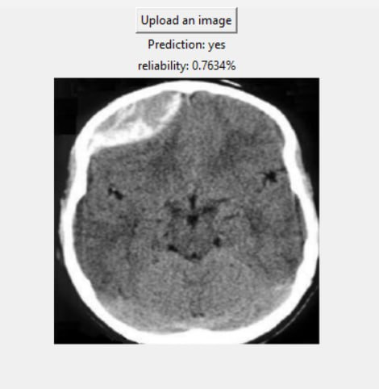
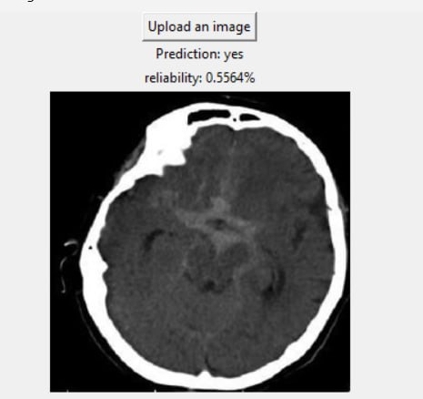
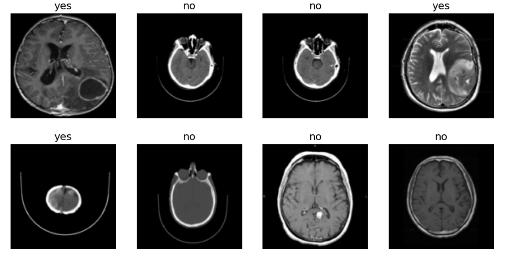

# CT_SCAN_CLASSIFICATION

<h4>I has developed this project based on the demand of "Shahid Hashemi Nezhad- Mashhad" hospital</h4>
<h2>yes/no classification of head trauma</h2>
<h3>Dataset size : 3125:yes & 4045:no (private hospital's data)</h3>
<h3>Learning Time on GPU: 18 Hour</h3>
<h3>Accuracy: 95%(Sensitive to "No" results)</h3>
<h3>NN: Customized ResNet</h3>
<h4>I have uploaded the initial sample of my work to show some of the work. Unfortunately, I am unable to upload the final code because of the hospital's privacy regulations. I will Upload some samples of the dataset and some videos of the program</h4>

